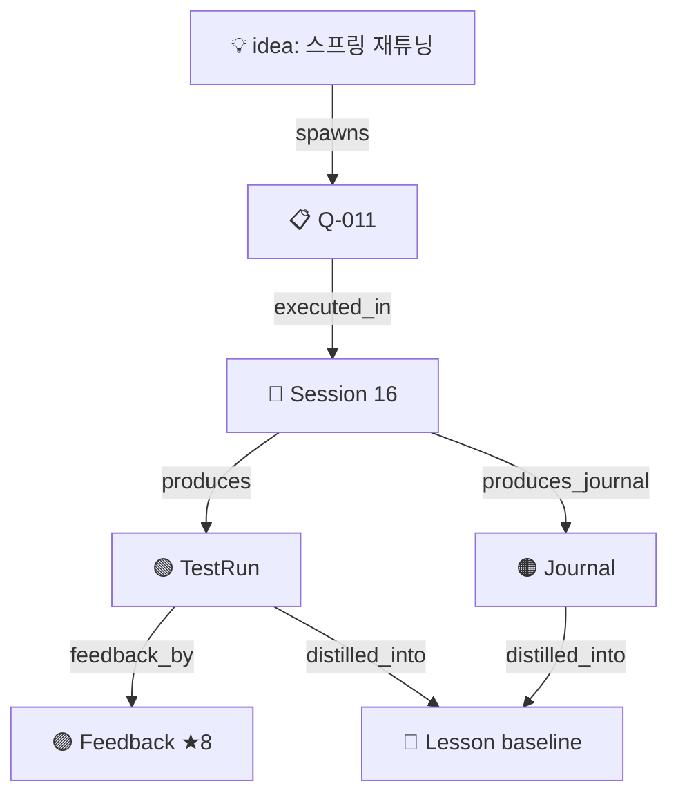

# DnT KnowledgeHub — 경험 기반 자동 지식축적 시스템 설계 명세서

> **작성일**: 2026-04-07
> **작성자**: 위상군 (Triad Chord Studio)
> **상태**: Draft (브레인스토밍 합의 완료, 사용자 검토 대기)
> **다음 단계**: writing-plans 스킬을 통한 구현 계획 작성

## 한 줄 요약

종일군의 사고·아이디어·세션 디테일·테스트 결과·교훈을 **단일 메타 레이어에 자동 축적**하여 노션 파편화 문제를 해결하고, 프로젝트·세션을 횡단하는 **복기 가능한 실전 지식 베이스**를 구축한다. Phase 1 MVP는 노드 7종 + 기록군 Subagent + 3중 누락 방지망 + Obsidian 시각화로 구성된다.

---

## 1. 배경

### 1.1 현재 상황의 고통

종일군은 여러 에이전트(위상군, 빌드군, 아트군, 기획군, 재미군, Fermion)와 협업하면서 다음 작업을 반복한다:

1. 작업 중 떠오르는 아이디어/가설을 기록
2. 아이디어를 에이전트 태스크로 변환
3. 구현·테스트 결과 기록
4. 결과에 대한 피드백·교훈 정리

이 모든 기록을 **노션 한 페이지에 마구잡이로** 작성해온 결과:
- 여러 세션·프로젝트의 메모가 섞여서 알아보기 힘듦
- 일관된 흐름이 보이지 않음
- 한 번의 작업이 끝나면 그 과정의 데이터·노하우가 사라지는 느낌
- **값진 경험의 디테일들이 핸드오버 요약 단계에서 압축·소실됨**

### 1.2 기존 인프라의 한계

탐색 결과 DnT 생태계에는 이미 여러 메모리 레이어가 존재한다:

| 레이어 | 작성자 | 한계 |
|---|---|---|
| `qmd_sessions/`, `handover_doc/` | 에이전트(자동) | **요약체** — 디테일 압축됨 |
| TEMS (`memory/error_logs.db`) | 에이전트(수동/자동) | **원자적 규칙** — 서사·맥락 부재 |
| `MRV_DnT/tems/`, `DnT_Fermion/tems/` | 빌드군/Fermion | **프로젝트별 분리** — 크로스 프로젝트 지식 공유 안 됨 |
| AutoMemory (`~/.claude/.../memory/`) | Claude(자동) | **개인 선호 위주** — 작업 흐름 캡처 안 함 |
| **노션** | **종일군(수동)** | **파편적, 검색 어려움, 누락 빈번** |

기존 시스템은 모두 **에이전트 관점**의 기록이고, 종일군 자신의 사고 흐름을 캡처하는 유일한 공간이 노션인데 그게 파편적이다. 핵심 공백:

1. 종일군 사고를 마찰 없이 캡처할 공간 부재
2. 세션 중 일어난 디테일·실수·실패가 핸드오버 요약 단계에서 손실
3. 테스트 결과의 원본 데이터가 보존되지 않아 복기 불가
4. 프로젝트 간 지식 결합·메타지식 생성이 자동으로 안 됨
5. 두 개 이상의 TEMS DB가 분리되어 있어 크로스 프로젝트 학습 부재

### 1.3 영감

이 시스템은 [LLM Wiki 컨셉](https://news.hada.io/topic?id=28208)에서 영감을 받았으나, 단순한 자동 위키가 아니라 **나선형 파이프라인(Build-Measure-Learn)을 자동화하는 Knowledge Accumulation Engine**으로 재정의했다. CLAUDE.md의 나선형 설계 원리(Spiral Model, OODA, Lean Startup, Double Diamond, Design Thinking)와 위상적으로 동형이다.

---

## 2. 목표 / 비목표

### 2.1 목표 (In Scope)

**Phase 1 MVP:**
1. 종일군의 아이디어·가설·느낌을 마찰 없이 캡처
2. 아이디어를 에이전트 태스크로 변환·추적
3. 세션·테스트 결과의 **원본 디테일 보존**
4. 세션 중 마찰·실수·실패의 **누락 없는 기록**
5. 종일군 피드백·교훈의 정리·아카이빙
6. 종일군이 매일 프로젝트 진행 흐름을 한눈에 조망
7. 에이전트가 과거 시점을 복기할 수 있는 인덱싱
8. 외부 프로젝트(`DnT_WesangGoon`, `MRV_DnT`, `DnT_Fermion`)의 핸드오버를 비파괴적으로 미러링

**Phase 2 (확장):**
- 나머지 에이전트(아트군, 기획군, 재미군)용 어댑터
- TEMS 승격 자동화 (Lesson → TEMS 규칙)
- 시각화 고도화 (Charts 플러그인, 주간 요약)
- 반복 마찰 자동 감지 → TEMS 후보 제안

**Phase 3 (메타):**
- 두 TEMS DB 통합 조회
- 크로스 프로젝트 메타지식 자동 생성 (Temporal Graph)
- 진행자 에이전트와의 깊은 통합

### 2.2 비목표 (Out of Scope)

이 스펙에서 다루지 **않는** 영역 (별도 결정·스펙 필요):

1. **진행자 에이전트(Facilitator) 패턴**
   - 종일군이 결정: "프로젝트별 진행자 에이전트가 필요"
   - 별도 후속 brainstorming 세션에서 다룸
   - 본 스펙은 **진행자가 사용할 위키 API**만 명시

2. **기획군 서브에이전트화 판단 실수 수정**
   - 종일군 인정: 직접 소통 회복 필요
   - 별도 작업 (CLAUDE.md 갱신, 독립 1급 에이전트 격상)

3. **전문 에이전트의 자체 서브에이전트 생성** (superpowers 패턴)
   - Claude Code 1단계 깊이 제약 우회 방안
   - 우회 권장안: 위키 기반 비동기 작업 큐 (Phase 2/3)

4. **DnT 외 프로젝트(QuantProject 등)의 진행 파이프라인 전환**
   - 종일군 의도: "기존 프로젝트들도 DnT처럼 바꾸려고"
   - 위키 시스템은 이를 지원하지만, 전환 자체는 별도 작업

5. **노드 본문 자체 편집기**
   - Claude Code + Obsidian + 일반 텍스트 에디터로 충분
   - 별도 GUI 만들지 않음

6. **외부 원본 파일의 자동 수정**
   - 어댑터는 **읽기 전용**. 절대 외부 프로젝트 원본을 수정하지 않음.

---

## 3. 설계 원칙

### 3.1 비파괴적 인덱싱
외부 프로젝트의 `handover_doc/`, `qmd_sessions/` 등은 **그대로 유지**한다. KnowledgeHub는 거울(mirror) + 메타 레이어 역할만 수행한다. 외부 원본을 수정하면 안 된다.

### 3.2 진실의 원본은 마크다운
SQLite는 재생성 가능한 파생물이다. `notes/*.md`만 살아 있으면 인덱스 전체를 재구축할 수 있다. 백업은 `notes/`만 백업해도 충분하다.

### 3.3 누락 최소화 우선
단일 에이전트가 모든 책임을 지는 구조보다 **여러 층에서 동일 정보를 잡아내는 중복 안전망**이 안전하다. 한 층이 놓쳐도 다른 층이 잡는다 (Section 7 참조).

### 3.4 디테일 보존이 요약보다 중요
핸드오버는 요약체이므로 디테일이 사라진다. KnowledgeHub의 `TestRun`과 `SessionJournal` 노드는 **압축하지 않고 원본 그대로** 저장한다. 복기 가능성이 핵심 KPI다.

### 3.5 사람의 창의·결정은 자동화하지 않음
기록군은 "지나간 일을 정리"하는 역할만 한다. 무엇을 할지 결정하는 것은 종일군의 몫. Idea 캡처·Feedback·TEMS 승격은 항상 사람 주도.

### 3.6 진행자와 위키의 분리
KnowledgeHub는 진행자에게 **데이터와 도구**를 제공하는 인프라다. 진행자 자체는 별도 시스템. 양방향 종속 금지. 위키 없이도 진행자는 작동 가능하고, 그 반대도 가능. 함께 있을 때 가치 극대화.

### 3.7 프로젝트 경계는 논리적 태그
물리적 폴더 위치가 아니라 frontmatter의 `project` 태그가 프로젝트 정의다. 한 파일이 여러 프로젝트 태그를 가질 수도 있고, 프로젝트 정의가 바뀌어도 원본 파일을 건드리지 않는다.

---

## 4. 아키텍처 개요

### 4.1 레이어 구조

```
┌──────────────────────────────────────────────┐
│  UI LAYER                                     │
│  · Claude Code (쓰기, 슬래시 커맨드)           │
│  · 기록군 Subagent (자동화)                    │
│  · Obsidian (읽기, Graph View, Dataview)      │
└──────────────────┬───────────────────────────┘
                   │
┌──────────────────▼───────────────────────────┐
│  INTERFACE LAYER                              │
│  · /k-capture, /k-journal, /k-feedback        │
│  · /k-search, /k-link, /k-index               │
│  · /k-graph, /k-girok, /k-promote             │
│  · WikiAPI (진행자 에이전트용)                  │
└──────────────────┬───────────────────────────┘
                   │
┌──────────────────▼───────────────────────────┐
│  INDEX LAYER                                  │
│  · SQLite FTS5 + 그래프 엣지                  │
│  · friction_patterns 테이블 (반복 감지)        │
│  · sync_state, mirrors, artifacts 테이블       │
│  · (.index/wiki.db)                           │
└──────────┬────────────────────┬──────────────┘
           │                    │
┌──────────▼─────────┐  ┌──────▼──────────────┐
│ STORAGE LAYER       │  │ ADAPTER LAYER        │
│ · notes/ 7종 노드   │  │ · 외부 원본 → mirrors│
│ · projects/ 랜딩    │  │ · 파일 watcher       │
│ · artifacts/ 원본   │  │ · 증분 동기화         │
│ · .agents/ 정의     │  │                      │
└─────────────────────┘  └──┬───────────────────┘
                            │ 읽기 전용
       ┌────────────────────┼─────────────────────┐
       │                    │                     │
┌──────▼─────────┐ ┌────────▼─────────┐ ┌────────▼─────────┐
│ E:/DnT/         │ │ E:/QuantProject/ │ │ 3개 TEMS DB      │
│ DnT_WesangGoon  │ │ DNT_GihakGoon    │ │ wesang/memory/   │
│ MRV_DnT         │ │ DNT_JaemiGoon    │ │ mrv/tems/        │
│ DnT_ArtGoon     │ │ DnT_Fermion      │ │ fermion/tems/    │
└────────────────┘ └──────────────────┘ └──────────────────┘
                  EXTERNAL SOURCES (READ-ONLY)
```

### 4.2 핵심 원칙 (재확인)
- **Storage Layer**가 진실의 원본 (마크다운)
- **Index Layer**는 재생성 가능한 파생물
- **Adapter Layer**는 외부 원본을 절대 수정하지 않음
- **UI Layer**는 두 갈래: Claude Code(쓰기/에이전트), Obsidian(읽기/탐색)

### 4.3 5개 데이터 흐름 시나리오

| # | 시나리오 | 흐름 |
|---|---|---|
| 1 | **캡처** | 종일군 `/k-capture idea` → `notes/*.md` 생성 → SQLite 행 추가 |
| 2 | **링크** | 에이전트가 `links.related` 추가 → edges 테이블 업데이트 |
| 3 | **자동 미러** | 빌드군이 `handover_doc/` 작성 → watcher 감지 → 어댑터 파싱 → `mirrors/build/*.stub.md` + 인덱스 갱신 |
| 4 | **검색** | 종일군이 Obsidian에서 "spring" 검색 → Dataview 쿼리가 `notes/` + `mirrors/` 동시 스캔 |
| 5 | **승격** (Phase 2) | Lesson 노드 완성 → `/k-promote` → TEMS 대상 선택 → 수동 승격 |

---

## 5. 파일 시스템 레이아웃

```
E:/KnowledgeHub/                  ← 독립 메타 프로젝트 (DnT 하위 아님)
├── README.md                     ← 위키 소개 + Obsidian 열기 가이드
│
├── .obsidian/                    ← Obsidian vault 설정
│   ├── core-plugins.json         ← Graph, Search, Templates 활성화
│   ├── community-plugins.json    ← Dataview, Charts 활성화
│   └── workspace.json            ← 기본 레이아웃
│
├── .index/                       ← 재생성 가능 인덱스 (숨김)
│   ├── wiki.db                   ← SQLite FTS5 + 엣지 + 메타
│   └── sync_checkpoint.json      ← 증분 동기화 체크포인트
│
├── khub/                         ← 실행 코드 (Python 패키지)
│   ├── schema.py                 ← 노드/엣지 스키마 정의
│   ├── indexer.py                ← notes/ → SQLite 동기화
│   ├── wiki_api.py               ← 진행자/에이전트용 조회 API
│   ├── adapters/
│   │   ├── __init__.py
│   │   ├── base.py               ← BaseAdapter
│   │   └── claude_standard.py    ← Phase 1 공통 어댑터
│   └── cli.py                    ← /k-* 명령 핸들러
│
├── .agents/                      ← Subagent 정의
│   └── girok-goon.md             ← 기록군 에이전트
│
├── projects/                     ← 프로젝트 랜딩 페이지 (Obsidian용)
│   ├── DnT_Game.md               ← DnT 게임 진행 상태
│   ├── DnT_Fermion.md            ← Fermion 엔진 진행 상태
│   └── Shared.md                 ← 범용 교훈
│
├── notes/                        ← 7종 노드 본체 (flat, frontmatter type 구분)
│   ├── 2026-04-07_idea_<slug>.md
│   ├── 2026-04-07_task_<task-id>.md
│   ├── 2026-04-07_session_<n>.md
│   ├── 2026-04-07_testrun_<slug>.md
│   ├── 2026-04-07_journal_<session>.md
│   ├── 2026-04-07_lesson_<slug>.md
│   └── 2026-04-07_feedback_<slug>.md
│
├── mirrors/                      ← 외부 원본 스텁 (auto-generated, 비파괴)
│   ├── wesang/                   ← E:/DnT/DnT_WesangGoon/handover_doc/...
│   ├── build/                    ← E:/DnT/MRV_DnT/handover_doc/...
│   ├── fermion/                  ← E:/QuantProject/DnT_Fermion/handover/...
│   ├── art/                      ← (Phase 2)
│   ├── gihak/                    ← (Phase 2)
│   └── jaemi/                    ← (Phase 2)
│
└── artifacts/                    ← 원본 데이터/이미지 보존
    ├── fermion/                  ← 백테스트 CSV, equity curve PNG
    ├── dnt/                      ← 스크린샷 (현재_/참고_ 쌍)
    └── shared/
```

### 5.1 설계 의도

1. **`notes/`는 flat 구조**: 한 노드가 여러 타입 속성을 가질 수 있어 폴더 분리 부적절. 구분은 frontmatter `type:` 필드.
2. **`mirrors/`는 스텁만**: 외부 파일 전체를 복사하지 않고 frontmatter 메타 + 요약 + 원본 경로만. 검색은 SQLite FTS5가 담당.
3. **`.index/`, `.agents/`는 숨김 디렉토리**: Obsidian에서 기본 숨김. `khub/`는 Python 패키지(PEP 517 호환)로 일반 디렉토리이며 Obsidian `userIgnoreFilters`로 숨김 처리.
4. **`artifacts/`는 무제한 원본**: 스크린샷, CSV, 차트 이미지, 백테스트 결과 등 큰 파일 보존.

---

## 6. 데이터 모델

### 6.1 노드 7종 개요

| # | 타입 | 목적 | 작성 주체 |
|---|---|---|---|
| 1 | `idea` | 사용자 사고·가설 캡처 | 종일군 (수동) |
| 2 | `task` | 실행 단위 | 위상군/진행자 (반자동) |
| 3 | `session` | 세션 메타 기록 | 기록군 (자동) |
| 4 | `test_run` ⭐ | 테스트 디테일 원본 보존 | 기록군 + 에이전트 (반자동) |
| 5 | `session_journal` ⭐ | 마찰·실수·과정 기록 | 기록군 + 종일군 (혼합) |
| 6 | `lesson` | 정제된 교훈 | 기록군 (반자동) |
| 7 | `feedback` | 종일군 피드백 | 종일군 (수동) |

### 6.2 공통 frontmatter (모든 노드)

```yaml
---
id: "idea-20260407-a3b5c2"        # 타입 prefix + 날짜 + 짧은 해시
type: idea                         # 7종 중 하나
project: DnT_Game                  # 논리 태그 (DnT_Game | DnT_Fermion | Shared)
title: "ItemSlotBar 스프링 재튜닝"
created: 2026-04-07T14:20:00+09:00
updated: 2026-04-07T14:20:00+09:00
agent_owner: wesang_goon           # 작성 주체
agent_role: director               # director | specialist | recorder | reviewer
                                   # ↑ 미래 진행자 에이전트 패턴 호환용
agent_project: DnT_Game            # 어느 프로젝트의 에이전트인가
tags: [motion, spring, UI, animation]
source_path: null                  # 미러일 때만: 외부 원본 경로
links:
  spawns: []                       # 이 노드가 촉발한 후속 노드
  spawned_by: []                   # 이 노드를 촉발한 선행 노드
  related: []                      # 일반 연관
  contradicts: []                  # 가설·결과 충돌
---
```

**참고**: `links`는 frontmatter와 SQLite `edges` 테이블에 **이중 저장**된다. SQLite가 진실의 원본(쿼리용), frontmatter는 인간 가독성 + Obsidian wiki-link 호환용 거울.

### 6.3 타입별 특화 필드

#### 6.3.1 `idea` — 사용자 사고 캡처

```yaml
status: raw | explored | promoted_to_task | abandoned
actionability: 0-10                # 구체성 점수
hypothesis: "stiffness 부족으로 bounce 큼"
expected_outcome: "더 단단한 드래그 감"
```

#### 6.3.2 `task` — 실행 단위

```yaml
task_id: "Q-011"                   # 기존 태스크 ID와 호환
priority: P0 | P1 | P2
status: pending | in_progress | done | blocked | abandoned
assigned_to: build_goon
estimated_effort: "2h"             # 자유 형식
completion_date: 2026-04-08 | null
source_handoff: "HO-005"           # 기존 핸드오프 ID 링크
```

#### 6.3.3 `session` — 세션 메타

```yaml
session_number: 16
session_owner: wesang_goon
duration_min: 180
date_range:
  start: 2026-04-07T09:00
  end: 2026-04-07T18:00
mirror_source: "E:/DnT/DnT_WesangGoon/handover_doc/2026-04-07_session16.md"
summary: "Phase A CSS 스킨 + 아트 파이프라인 수립"
```

#### 6.3.4 `test_run` ⭐ — 핵심 디테일 보존 노드

**프로젝트별 다형적 스키마**. 같은 `type: test_run`이지만 필드가 다름.

**Fermion 퀀트 서브타입:**
```yaml
test_category: backtest | unit_test | integration_test
executor: jaemi_goon
test_script: "DnT_Simulator/tests/backtest/test_compass_v4_final.py"
test_design: |
  COMPASS V4 L3 레이어 추가 후 SOXX 2020-2026 백테스트.
  비상제동 발동 횟수와 MDD 관찰.
input_data:
  file: "data/SOXX_daily_2020-2026.csv"
  period: "2020-01-01~2026-03-31"
  rows: 1574
parameters:
  compass_l3_weights: {VIX: 0.3, M2: 0.4, SOXX: 0.3}
  divergence_threshold: 0.15
results:
  return_rate: 87.6
  mdd: -19.2
  sharpe: 2.1
  brake_triggers: 12
artifacts:
  equity_curve: "fermion/2026-04-07_equity_curve.png"
  trades: "fermion/2026-04-07_trades.csv"
comparison:
  baseline: "testrun-2026-04-01-fermion-001"
  delta_return: +2.3
  delta_mdd: -3.1
```

**DnT 게임 서브타입:**
```yaml
test_category: playtest | ux_test
executor: jongil
build:
  version: "v3.0.8"
  commit: "abc123def"
  platform: "web/chrome"
test_scenario: "ItemSlotBar 스프링 파라미터 튜닝 후 드래그 감각 검증"
bugs_found:
  - id: bug-001
    severity: medium
    description: "ItemSlotBar 스프링이 너무 탄력적"
    reproduction: ["아이템 선택", "드래그 100px", "놓기"]
screenshots:                       # TCL #47 명명규칙 호환
  current: "dnt/2026-04-07_현재_itemslot_bounce.png"
  reference: "dnt/2026-04-07_참고_itemslot_stable.png"
feedback:
  user: jongil
  rating: 6
  notes: "ItemSlotBar는 NavRail보다 단단해야. stiffness 200+ 검토"
next_actions:
  - "ItemSlotBar stiffness 200/250/300 스윕"
```

**핵심**: `parameters`, `results`, `input_data`는 자유 형식 key-value. 프로젝트별 필요 필드가 다르므로 강제 스키마 없음. SQLite에는 `raw_frontmatter` JSON 필드로 통째 저장하고, FTS5로 전문 검색.

#### 6.3.5 `session_journal` ⭐ — 마찰·실수·과정 기록

```yaml
session_ref: "session-2026-04-07"
friction_events:
  - id: friction-001
    type: repeated_error | dead_end | parameter_sweep | tool_misuse | uncertain
    pattern: "npm run dev → EADDRINUSE :3000"
    count: 3
    duration_min: 15
    context: "모션 작업 도중"
    resolved_by: "kill -9 잔여 프로세스"
    should_promote_to_tgl: false   # 기록군 초기 판단
  - id: friction-002
    type: dead_end
    attempt: "framer-motion stiffness=300"
    why_abandoned: "오히려 bounce 심해짐"
    kept_as_reference: true
unresolved:
  - "NavRail transition 가끔 끊김 — 재현 불가"
repeat_detection:                   # 기록군이 채움
  similar_past_events: []           # 과거 유사 패턴 노드 ID
  promotion_score: 0.3              # 0-1 (TEMS 승격 후보 강도)
```

#### 6.3.6 `lesson` — 정제된 교훈

```yaml
generality: local | project | cross-project | universal
lesson_text: "DnT UI 드래그 컴포넌트는 stiffness 250~280이 기본"
evidence: ["testrun-spring-001", "journal-session16"]
tems:
  promoted: false
  db: null                          # wesang | mrv | fermion (Phase 2)
  rule_id: null
confidence: 0.8
expires: null                       # 수명 힌트 (선택)
```

#### 6.3.7 `feedback` — 종일군 피드백

```yaml
target_node: "testrun-spring-001"
from_user: jongil
sentiment: positive | negative | neutral | mixed
rating: 6                           # 1-10 (선택)
decision: keep | revise | discard | pivot
notes: |
  ItemSlotBar는 NavRail보다 단단해야 한다.
  stiffness 200+ 검토 필요.
spawned_ideas: []                  # 이 피드백이 낳은 새 아이디어 ID
```

### 6.4 엣지 관계 카탈로그 (8종)

| 관계 | 방향 | 의미 | 예시 |
|---|---|---|---|
| `spawns` | A → B | A가 B를 낳음 | Idea→Task, Feedback→Idea |
| `executed_in` | Task → Session | Task가 어느 Session에서 수행됨 | task-Q011 → session-16 |
| `produces` | Session → TestRun | Session이 TestRun을 낳음 | session-16 → testrun-spring |
| `produces_journal` | Session → Journal | Session의 마찰 기록 | session-16 → journal-16 |
| `distilled_into` | TestRun/Journal → Lesson | 경험이 교훈으로 정제 | testrun → lesson |
| `feedback_by` | Feedback → Target | Feedback이 어느 노드에 대한 반응 | feedback → testrun |
| `contradicts` | Node ↔ Node | 충돌 관계 | testrun-A ↔ testrun-B |
| `generalizes_into` | Lesson → MetaLesson | 크로스 프로젝트 메타지식 | (Phase 3) |

**루프 완결 경로:**
- 메인 루프: `Idea → Task → Session → TestRun → Lesson → (teaches) → Idea'`
- 피드백 루프: `TestRun → Feedback → (spawns) → Idea' → Task'`
- 마찰 루프: `Session → SessionJournal → (promotion_score ≥ τ) → Lesson → TEMS`

### 6.5 SQLite 스키마 (전체)

```sql
-- ═══════════════════════════════════════════════════
-- 1. 노드 테이블 (frontmatter 인덱스)
-- ═══════════════════════════════════════════════════
CREATE TABLE nodes (
    id TEXT PRIMARY KEY,                -- "idea-20260407-a3b5c2"
    type TEXT NOT NULL,                 -- idea | task | session | test_run |
                                        -- session_journal | lesson | feedback
    project TEXT,                       -- DnT_Game | DnT_Fermion | Shared
    title TEXT NOT NULL,
    file_path TEXT NOT NULL UNIQUE,     -- notes/... or mirrors/...
    created TEXT NOT NULL,
    updated TEXT NOT NULL,
    agent_owner TEXT,
    agent_role TEXT,                    -- director | specialist | recorder | reviewer
    agent_project TEXT,
    tags TEXT,                          -- space-separated
    
    -- 타입별 조회 가속 필드 (모두 nullable)
    status TEXT,                        -- Task용
    priority TEXT,                      -- Task용
    test_category TEXT,                 -- TestRun용
    generality TEXT,                    -- Lesson용
    external_id TEXT,                   -- Q-005, HO-005 등
    source_path TEXT,                   -- 외부 원본 경로 (미러 전용)
    
    raw_frontmatter TEXT NOT NULL       -- 전체 frontmatter JSON
);
CREATE INDEX idx_nodes_type_project ON nodes(type, project);
CREATE INDEX idx_nodes_created      ON nodes(created DESC);
CREATE INDEX idx_nodes_status       ON nodes(status) WHERE status IS NOT NULL;
CREATE INDEX idx_nodes_owner        ON nodes(agent_owner);

-- ═══════════════════════════════════════════════════
-- 2. 엣지 테이블
-- ═══════════════════════════════════════════════════
CREATE TABLE edges (
    id INTEGER PRIMARY KEY AUTOINCREMENT,
    source_id TEXT NOT NULL,
    target_id TEXT NOT NULL,
    relation TEXT NOT NULL,             -- 8종 중 하나
    weight REAL DEFAULT 1.0,
    created_at TEXT DEFAULT (datetime('now')),
    metadata TEXT,                      -- JSON, optional
    FOREIGN KEY (source_id) REFERENCES nodes(id) ON DELETE CASCADE,
    FOREIGN KEY (target_id) REFERENCES nodes(id) ON DELETE CASCADE,
    UNIQUE(source_id, target_id, relation)
);
CREATE INDEX idx_edges_source ON edges(source_id, relation);
CREATE INDEX idx_edges_target ON edges(target_id, relation);

-- ═══════════════════════════════════════════════════
-- 3. 태그 테이블 (M:N)
-- ═══════════════════════════════════════════════════
CREATE TABLE tags (
    node_id TEXT NOT NULL,
    tag TEXT NOT NULL,
    PRIMARY KEY (node_id, tag),
    FOREIGN KEY (node_id) REFERENCES nodes(id) ON DELETE CASCADE
);
CREATE INDEX idx_tags_tag ON tags(tag);

-- ═══════════════════════════════════════════════════
-- 4. FTS5 전문검색
-- ═══════════════════════════════════════════════════
CREATE VIRTUAL TABLE nodes_fts USING fts5(
    id UNINDEXED,
    type UNINDEXED,
    project UNINDEXED,
    title,
    body,
    tags_concat,
    content='',
    tokenize='unicode61'
);

-- 트리거: nodes 변경 시 FTS 자동 동기화
CREATE TRIGGER nodes_ai AFTER INSERT ON nodes BEGIN
    INSERT INTO nodes_fts(id, type, project, title, body, tags_concat)
    VALUES (new.id, new.type, new.project, new.title, '', new.tags);
END;

CREATE TRIGGER nodes_au AFTER UPDATE ON nodes BEGIN
    DELETE FROM nodes_fts WHERE id = old.id;
    INSERT INTO nodes_fts(id, type, project, title, body, tags_concat)
    VALUES (new.id, new.type, new.project, new.title, '', new.tags);
END;

CREATE TRIGGER nodes_ad AFTER DELETE ON nodes BEGIN
    DELETE FROM nodes_fts WHERE id = old.id;
END;

-- ═══════════════════════════════════════════════════
-- 5. 외부 미러 동기화 상태
-- ═══════════════════════════════════════════════════
CREATE TABLE mirrors (
    source_path TEXT PRIMARY KEY,        -- 원본 파일 절대 경로
    node_id TEXT NOT NULL,               -- mirrors/ 하위 노드
    source_hash TEXT NOT NULL,           -- SHA-256 (변경 감지)
    last_synced TEXT NOT NULL,
    adapter TEXT NOT NULL,               -- 어댑터 이름
    protected INTEGER DEFAULT 0,         -- 사용자 직접 편집 시 1
    source_missing INTEGER DEFAULT 0,    -- 원본 삭제 시 1
    FOREIGN KEY (node_id) REFERENCES nodes(id)
);

CREATE TABLE sync_state (
    source_root TEXT PRIMARY KEY,        -- E:/DnT/MRV_DnT/handover_doc
    adapter_name TEXT,
    last_scan TEXT NOT NULL,
    last_file_mtime TEXT
);

-- ═══════════════════════════════════════════════════
-- 6. 반복 마찰 패턴 카운터 (TEMS 승격 보조)
-- ═══════════════════════════════════════════════════
CREATE TABLE friction_patterns (
    pattern_hash TEXT PRIMARY KEY,       -- normalized pattern의 SHA-256
    pattern_text TEXT NOT NULL,
    pattern_type TEXT,                   -- repeated_error | dead_end | ...
    first_seen TEXT NOT NULL,
    last_seen TEXT NOT NULL,
    occurrence_count INTEGER DEFAULT 1,
    source_journals TEXT,                -- JSON 배열: journal node IDs
    promoted_to_tems INTEGER DEFAULT 0,
    tems_db TEXT,                        -- wesang | mrv | fermion
    tems_rule_id INTEGER
);
CREATE INDEX idx_friction_count ON friction_patterns(occurrence_count DESC);

-- ═══════════════════════════════════════════════════
-- 7. 아티팩트 카탈로그
-- ═══════════════════════════════════════════════════
CREATE TABLE artifacts (
    path TEXT PRIMARY KEY,               -- artifacts/ 하위 상대 경로
    node_id TEXT NOT NULL,               -- 소유 노드
    kind TEXT NOT NULL,                  -- image | csv | json | chart | other
    created TEXT NOT NULL,
    size_bytes INTEGER,
    description TEXT,
    FOREIGN KEY (node_id) REFERENCES nodes(id)
);
CREATE INDEX idx_artifacts_node ON artifacts(node_id);
```

### 6.6 파일 네이밍 규칙

```
notes/<YYYY-MM-DD>_<type>_<slug>.md

예:
  2026-04-07_idea_spring-retune.md
  2026-04-07_task_Q-011_spring.md
  2026-04-07_session_16.md
  2026-04-07_testrun_spring-tuning.md
  2026-04-07_journal_session16.md
  2026-04-07_lesson_spring-baseline.md
  2026-04-07_feedback_spring-approval.md
```

`id` 필드(frontmatter)가 진짜 식별자이고, 파일명은 인간 가독용. 파일명이 바뀌어도 `id`는 유지.

---

## 7. 누락 방지 3중 안전망 (Triple Safety Net)

종일군의 핵심 요구사항: **누락 최소화가 우선**. 단일 기록군이 모든 책임을 지는 구조보다 여러 층에서 같은 정보를 잡아내는 중복 안전망이 정직하다.

### 7.1 4-Tier 구조

```
┌─────────────────────────────────────┐
│  Tier 0: 종일군 (사람)                │
│  · /k-capture, /k-journal 수동        │
│  · 가장 신뢰도 ↑, 가장 마찰 ↑          │
└──────────────┬──────────────────────┘
               │
┌──────────────▼──────────────────────┐
│  Tier 1: 능동 기록자 (전문 에이전트)   │  ⭐ 핵심
│  · 각 전문 에이전트가 작업 직후         │
│    /k-capture를 직접 호출              │
│  · "내 일은 내가 가장 잘 안다"          │
│  · 의무 조항을 각 에이전트              │
│    CLAUDE.md/agent prompt에 추가      │
└──────────────┬──────────────────────┘
               │
┌──────────────▼──────────────────────┐
│  Tier 2: 기록군 (의식적 보충)          │
│  · Stop hook + 명시적 호출             │
│  · 세션 로그를 스캔하여 Tier 1이        │
│    놓친 것을 자동 보충                  │
└──────────────┬──────────────────────┘
               │
┌──────────────▼──────────────────────┐
│  Tier 3: 미러 어댑터 (자동)            │
│  · 파일 watcher가 외부 핸드오버         │
│    변경 감지 시 자동 미러링              │
│  · 에이전트가 최소한 핸드오버만 쓰면     │
│    자동으로 잡힘                        │
└─────────────────────────────────────┘
```

### 7.2 신뢰도 누적

- Tier 1만: 70% (에이전트가 잊을 수 있음)
- Tier 1 + 2: 90% (기록군 보충)
- Tier 1 + 2 + 3: 99%+ (핸드오버까지 자동 미러)

### 7.3 중복 제거

같은 이벤트가 여러 Tier에서 잡혀도 **`source_hash` + `content_signature`**로 중복 통합. 1개 노드로 정리. 단, **출처 메타데이터는 모두 보존** (어느 Tier에서 잡혔는지 추적 가능).

### 7.4 미감지 패턴 알림

별도 검사 메커니즘. 매일 자정에 SQLite 트리거로:

```sql
SELECT date, agent_owner, COUNT(*) AS node_count
FROM nodes
WHERE created BETWEEN ? AND ?
GROUP BY date, agent_owner
HAVING node_count = 0;
```

→ 결과 있으면 기록군이 다음 날 종일군에게 알림: "어제 X 에이전트 활동이 있었지만 노드가 없음. 누락 가능성. 수동 검토 필요."

### 7.5 Tier 1 의무 조항 (예시)

각 전문 에이전트의 CLAUDE.md / agent prompt에 추가:

```markdown
## 작업 종료 의무 (Knowledge Recording Duty)

모든 작업 단위 완료 시 다음을 호출한다:
- /k-capture testrun "Q-XXX 결과" --category playtest --artifact ...
- 실패한 시도가 있었다면: /k-journal "패턴" --type dead_end --duration-min N

이는 위상군이나 기록군이 잡지 못할 수 있는 디테일을 보존하기 위함이다.
"누군가 잡아줄 거다"고 가정하지 말 것.
```

---

## 8. 어댑터 레이어

### 8.1 공통 인터페이스

```python
# khub/adapters/base.py
from pathlib import Path
from datetime import datetime
from dataclasses import dataclass

@dataclass
class ParsedNode:
    type: str
    project: str
    title: str
    summary: str
    extracted_entities: dict
    raw_content: str
    source_metadata: dict

class BaseAdapter:
    name: str
    source_roots: list[Path]
    file_pattern: str  # glob 패턴
    
    def discover(self, since: datetime) -> list[Path]:
        """since 이후 수정/추가된 원본 파일 탐지"""
        ...
    
    def parse(self, file_path: Path) -> ParsedNode:
        """원본 → 공통 노드 구조로 변환"""
        ...
    
    def to_mirror(self, parsed: ParsedNode, target_dir: Path) -> Path:
        """mirrors/ 하위 스텁 파일 생성"""
        ...
```

### 8.2 Phase 1 어댑터: `claude_standard` 1개

세 프로젝트 동시 커버:

| 소스 | 경로 패턴 |
|---|---|
| 위상군 | `E:/DnT/DnT_WesangGoon/handover_doc/*.md`, `qmd_sessions/*.md` |
| 빌드군 | `E:/DnT/MRV_DnT/handover_doc/*.md`, `docs/handoffs/HO-*.md` |
| Fermion | `E:/QuantProject/DnT_Fermion/handover_doc/*.md`, `Claude-Sessions/*.md`, `qmd_sessions/*.md` |

**공통점**: 모두 Claude Code 표준 포맷 (frontmatter 가능 + 마크다운 본문 + `## 세션 요약` / `## 논의 및 결정` / `## 미완료 사항` 섹션).

### 8.3 파싱 결과 예시

원본: `E:/DnT/DnT_WesangGoon/handover_doc/2026-03-29_session16.md`

미러 결과: `E:/KnowledgeHub/mirrors/wesang/2026-03-29_session16.stub.md`

```yaml
---
id: mirror-wesang-20260329-session16
type: session
project: DnT_Game
agent_owner: wesang_goon
agent_role: director
source_path: "E:/DnT/DnT_WesangGoon/handover_doc/2026-03-29_session16.md"
source_hash: "sha256:abc123..."
imported_at: 2026-04-07T14:20:00+09:00
session_number: 16
date: 2026-03-29
summary: "아트 파이프라인 + Phase A 스킨 + UX 리사이즈"
extracted_entities:
  tasks: [Q-002, Q-004, Q-010]
  handoffs: [HO-005, HO-007, HO-008]
  external_artifacts:
    - "E:/MRV/docs/handoffs/HO-005_art-pipeline-phase-a.md"
    - "E:/ART_Project/specs/UI_ELEMENT_CATALOG.md"
---

## 미러 요약
(원본의 첫 200자 + 구조 링크만)

전체 본문 검색은 SQLite FTS5가 담당.
원본 열람: source_path 클릭.
```

### 8.4 Phase 2 추가 어댑터

- `art_adapter`: 아트군 `handover/`, `qmd_sessions/`, `specs/`, `ASSET_MANIFEST.json` 링크 추적
- `jaemi_adapter`: 재미군 `Claude-Sessions/`, `DEVLOG.md`, `README_HANDOFF.md`, `work_journal/`
- `gihak_adapter`: 기획군 `proposals/`, `reviews/`, `gdd/`, `wireframes/` (산출물 중심, 핸드오버 없음)

### 8.5 인덱싱 파이프라인

```
[외부 원본 변경]
      ↓
[주기 폴링 5분 or watchdog 이벤트]
      ↓
[sync_state 조회 → 변경 파일만 picking]
      ↓
[경로 기반 어댑터 선택]
      ↓
[파싱: frontmatter + 본문 요약 + 엔티티 추출]
      ↓
[mirrors/<project>/*.stub.md 생성]
      ↓
[SQLite 업데이트: nodes, edges, fts, mirrors, sync_state]
      ↓
[기록군 알림 (옵션)]
```

### 8.6 증분 감지의 신뢰성

3단계 감지:
1. `sync_state.last_scan` 이후 수정된 파일만 후보
2. 파일 mtime 비교 (초 단위)
3. SHA-256 해시 비교 (가장 확실)

첫 풀 스캔 1회만 무겁고 이후는 가벼움.

### 8.7 충돌 처리

| 상황 | 처리 |
|---|---|
| 외부 원본 수정 | 새 스냅샷으로 미러 덮어쓰기. 이전은 `mirrors/_history/`에 보관 (Phase 2) |
| 미러를 사용자가 직접 편집 | `source_hash` 불일치 → `protected: true` 마킹 → 자동 덮어쓰기 중단 → 종일군 확인 요청 |
| 외부 원본 삭제 | `source_missing: true` 플래그. 미러는 유지 (지식 손실 방지) |

---

## 9. 슬래시 커맨드 (8개)

### 9.1 `/k-capture` — 노드 생성 진입점

```bash
/k-capture idea "ItemSlotBar 스프링 재튜닝" \
  [--project DnT_Game] [--hypothesis "..."]

/k-capture task "Q-011 스프링 튜닝" \
  --task-id Q-011 --priority P1 \
  --assigned-to build_goon --spawned-by idea-a3b5

/k-capture testrun "백테스트 V4" \
  --category backtest --artifact path1,path2

/k-capture session [--owner agent] [--number N]

/k-capture feedback "좋은데 더 단단해도 OK" \
  --target testrun-xxx --rating 8 --decision keep
```

**동작:**
1. 프로젝트 미지정 시 현재 위상군 프로젝트(DnT_Game) 기본값
2. frontmatter 템플릿 자동 생성 (ID 자동)
3. `notes/` 아래 파일 쓰기
4. SQLite 업데이트
5. 파일 경로 반환 (에디터에서 바로 열기 가능)

### 9.2 `/k-journal` — SessionJournal 마찰 추가

```bash
/k-journal "패턴 텍스트" \
  --type dead_end | repeated_error | parameter_sweep | uncertain \
  [--count N] [--duration-min M] [--resolved-by "..."]
```

**동작:**
1. 현재 세션의 journal 노드 찾기 (없으면 생성)
2. `friction_events` 배열에 추가
3. `friction_patterns` 테이블 업데이트 (반복 감지)
4. `count` 임계값 초과 시 TEMS 승격 후보 알림

### 9.3 `/k-feedback` — 종일군 피드백 (jongil 전용)

```bash
/k-feedback "notes" --target node-id \
  [--rating 1-10] [--sentiment positive|negative|neutral|mixed] \
  [--decision keep|revise|discard|pivot]
```

### 9.4 `/k-search` — 하이브리드 검색

```bash
/k-search "query"                          # FTS5 BM25
/k-search "query" --type lesson             # 타입 필터
/k-search "query" --project DnT_Game --since 2026-04-01
/k-search "query" --related-to testrun-xxx  # 그래프 이웃 탐색
```

결과: 노드 목록 + 요약 + 엣지 요약 + 파일 경로.

### 9.5 `/k-link` — 수동 엣지 추가

```bash
/k-link <source-id> <target-id> <relation>

/k-link idea-a3b5 task-Q011 spawns
/k-link testrun-q011 lesson-spring distilled_into
/k-link testrun-a testrun-b contradicts
```

### 9.6 `/k-index` — 수동 재인덱싱 (디버깅·복구)

```bash
/k-index --full              # 전체 재스캔
/k-index --source wesang     # 특정 소스만
/k-index --rebuild-fts       # FTS5만 재구축
```

### 9.7 `/k-graph` — 그래프 조회 (Obsidian 대안)

```bash
/k-graph node idea-a3b5 --depth 2     # 노드 중심 2단계 그래프
/k-graph project DnT_Game --week      # 주간 활동 그래프
```

콘솔에 텍스트 트리 출력. Obsidian 안 켰을 때.

### 9.8 `/k-girok` — 기록군 수동 호출

```bash
/k-girok "지난 세션 정리해줘"
/k-girok "이번 주 friction 리뷰"
/k-girok "testrun-q011 관련 모든 노드 그래프화"
```

### 9.9 `/k-promote` — TEMS 승격 (Phase 2)

```bash
/k-promote <lesson-id> --to wesang|mrv|fermion
```

---

## 10. 기록군 (GirokGoon) Subagent

### 10.1 정의 파일

`E:/KnowledgeHub/.agents/girok-goon.md`:

```markdown
---
name: girok-goon
description: DnT KnowledgeHub 전속 큐레이터. 세션 기록, 교훈 추출, 마찰 감지, 미러링, 시각화 자동 관리.
model: sonnet
tools: Read, Write, Edit, Glob, Grep, Bash(python:*), Bash(sqlite3:*)
---

# 기록군 (GirokGoon) — Knowledge Curator

## 페르소나
- 종일군에게는 말 없는 사관(史官)
- 다른 에이전트와는 협력자, 단 산출물 정리만 담당
- 흐름을 만들지 않고 기록만 한다

## 책임
1. 세션 종료 시 Session/TestRun/SessionJournal 노드 자가 생성
2. 외부 핸드오버 변경 감지 시 공통 어댑터로 미러 생성
3. friction_patterns 테이블 모니터링 → TEMS 승격 후보 제안
4. 주간 시각화 자동 갱신 (projects/*.md 랜딩, Dataview, Mermaid)
5. (Phase 3) 크로스 프로젝트 메타지식 탐지

## 절대 금지
- 외부 원본 파일 수정 금지 (mirrors/만 씀)
- Idea/Feedback 노드 수정 금지 (종일군 전유)
- 설계·구현·기획 관여 금지

## 자동 트리거
- Stop hook: 세션 요약 + 노드 자동 생성
- 파일 watcher 이벤트: 해당 소스 어댑터 파싱
- 일 1회 (자정): friction 리뷰, 랜딩 페이지 갱신
- 주 1회 (월요일): 주간 요약 + Mermaid 타임라인

## 조회 API (다른 에이전트가 호출)
- search_nodes(query, filters) → FTS5 BM25 결과
- get_node_history(node_id) → 전체 타임라인
- find_similar_past(pattern) → 유사 과거 사례
- suggest_tems_promotion() → 승격 후보 리스트
```

### 10.2 자동화 vs 수동 경계

| 작업 | 주체 | 비고 |
|---|---|---|
| Idea 캡처 | 🧑 종일군 수동 | 창의 = 사람 |
| Task 생성 | 👔 위상군 반자동 | 아이디어 검토 후 구조화 |
| Session 생성 | 🤖 기록군 자동 | Stop hook |
| TestRun 생성 | 🤖 기록군 반자동 | 에이전트 보고 + aggregation |
| SessionJournal | 🤖+🧑 혼합 | 자동 감지 + 수동 기록 |
| Feedback | 🧑 종일군 수동 | 사용자 판단 |
| Lesson | 🤖 기록군 반자동 | 자가 제안 → 종일군 승인 |
| 엣지 링크 | 🤖 기록군 자동 | 커맨드 옵션으로 즉시 |
| TEMS 승격 | 🧑 종일군 수동 | 중요 결정 = 자동화 금지 |
| 미러링 | 🤖 기록군 자동 | 파일 watcher |
| 시각화 갱신 | 🤖 기록군 자동 | 일 1회 주기 |

**핵심 원칙**: 사람의 창의·심미·판단은 자동화 금지. 기록군은 "지나간 일을 정리"하는 역할에 한정.

---

## 11. 진행자 인터페이스 (WikiAPI)

### 11.1 목적

위키는 진행자 에이전트(future)에게 데이터·도구를 제공한다. 본 스펙은 **위키가 노출하는 API만** 정의하며, 진행자 자체 설계는 별도 brainstorming 트랙에서 다룬다.

### 11.2 API 명세

```python
# khub/wiki_api.py

class WikiAPI:
    """진행자/에이전트가 사용할 위키 조회·기록 API"""
    
    # ─── 검색 ─────────────────────────────
    def search(query: str, filters: dict = None) -> list[Node]:
        """FTS5 BM25 검색 + 필터 (type, project, since, until, agent_owner)"""
    
    def search_by_tag(tag: str, project: str = None) -> list[Node]:
        """태그 기반 조회"""
    
    # ─── 그래프 조회 ──────────────────────
    def get_neighbors(node_id: str, relation: str = None, depth: int = 1) -> list[Node]:
        """노드의 이웃 (특정 관계, 깊이 지정 가능)"""
    
    def get_history(node_id: str) -> list[Node]:
        """노드와 연결된 전체 시간순 노드 체인"""
    
    def find_similar(pattern: str, type: str = None) -> list[Node]:
        """유사 패턴 검색 (반복 마찰, 비슷한 교훈 등)"""
    
    # ─── 프로젝트 단위 ────────────────────
    def get_project_timeline(project: str, since: str, until: str = None) -> list[Node]:
        """프로젝트의 시간순 활동"""
    
    def get_pending_tasks(project: str = None, owner: str = None) -> list[Node]:
        """미완료 태스크 큐"""
    
    def get_recent_lessons(since: str) -> list[Node]:
        """최근 정리된 교훈"""
    
    # ─── 기록 ─────────────────────────────
    def add_node(type: str, frontmatter: dict, body: str) -> str:
        """새 노드 생성, ID 반환"""
    
    def add_edge(source: str, target: str, relation: str) -> None:
        """엣지 추가"""
    
    def update_node(node_id: str, updates: dict) -> None:
        """frontmatter/body 업데이트"""
    
    # ─── 메타 ─────────────────────────────
    def get_friction_candidates() -> list[FrictionPattern]:
        """TEMS 승격 후보 마찰 패턴"""
    
    def get_metaknowledge_suggestions() -> list[Suggestion]:
        """크로스 프로젝트 메타지식 후보 (Phase 3)"""
```

### 11.3 사용 주체

이 API는 진행자뿐만 아니라:
- 다른 전문 에이전트 (빌드군, 기획군, 아트군, 재미군, Fermion)
- 기록군 본인 (내부 호출)
- 종일군 (CLI 또는 직접 Python 호출)

→ **위키가 모든 에이전트의 비동기 소통 백본** 역할.

---

## 12. Obsidian 통합 + 시각화

### 12.1 Vault 기본 설정

`.obsidian/` 내부:

**활성화 코어 플러그인:**
- Graph view, Local graph, Search, Backlinks, Outline, Tags, Templates, Daily notes

**필수 커뮤니티 플러그인:**
- **Dataview**: frontmatter 기반 동적 쿼리
- **Charts**: 시계열 차트 (Phase 1 후반 또는 Phase 2)

**선택 커뮤니티 플러그인:**
- **Templater**: 노드 템플릿 자동 채움
- **Kanban**: 태스크 큐 칸반 (Phase 2)

### 12.2 Graph View 색상 (타입별)

| 타입 | 색상 |
|---|---|
| `idea` | 🟡 노랑 |
| `task` | 🔵 파랑 |
| `session` | ⚪ 회색 |
| `test_run` | 🟢 초록 |
| `session_journal` | 🟠 주황 |
| `lesson` | 🔴 빨강 |
| `feedback` | 🟣 보라 |

노드 크기는 백링크 수 비례. 그룹 필터로 프로젝트별 보기.

### 12.3 Dataview 쿼리 카탈로그 (Phase 1 기본 10개)

| # | 이름 | 용도 |
|---|---|---|
| Q1 | 이번 주 활동 요약 | 대시보드 |
| Q2 | 진행 중 태스크 (프로젝트별) | 작업 큐 |
| Q3 | Fermion 백테스트 결과 비교 | 퀀트 분석 |
| Q4 | SessionJournal 마찰 패턴 (이번 달) | 디버깅 회고 |
| Q5 | TEMS 승격 후보 | 메타 학습 |
| Q6 | 종일군 피드백 평점 | 프로젝트 건강도 |
| Q7 | 교훈 카탈로그 (일반화 정도별) | 지식 베이스 |
| Q8 | 미완료 아이디어 (구체성 순) | 아이디어 큐 |
| Q9 | 태스크-세션-교훈 체인 추적 | 사이클 가시화 |
| Q10 | 지난 30일 활동 통계 (타입별) | 정량 모니터링 |

(전체 쿼리 본문은 부록 A 참조)

### 12.4 프로젝트 랜딩 페이지 자동 갱신

`projects/DnT_Game.md` (예시):

```markdown
# DnT_Game 프로젝트 상태
> 마지막 갱신: 2026-04-07T20:00 (기록군 자동)
> project: DnT_Game

## 진행자
위상군 (E:/DnT/DnT_WesangGoon)

## 협력 에이전트
- 빌드군 (E:/DnT/MRV_DnT)
- 아트군 (E:/DnT/DnT_ArtGoon)
- 기획군 (E:/QuantProject/DNT_GihakGoon)

## 📊 이번 주 활동 [Q1 임베드]
## 🚀 진행 중 태스크 [Q2 임베드]
## 🎓 최근 교훈 5건 [Q7 변형 임베드]
## ⚠️ 미해결 마찰 패턴 [Q4 임베드]
```

랜딩 페이지는 기록군이 일 1회 자동 갱신. 종일군이 직접 편집할 필요 없음.

### 12.5 Mermaid 다이어그램 (자동 삽입)

기록군이 Lesson 노드 생성 시 본문에 자동 삽입:



### 12.6 시각화 자동 생성 트리거

| 시점 | 작업 |
|---|---|
| 세션 종료 | 해당 세션 그래프 → session 노드 본문 삽입 |
| TestRun 생성 | 비교 baseline + 차트 데이터 갱신 |
| Lesson 생성 | 그래프 다이어그램 자동 삽입 |
| 일 1회 (자정) | 모든 `projects/*.md` 랜딩 페이지 갱신 |
| 주 1회 (월요일) | 주간 타임라인 + 통계 보고서 |

---

## 13. 사용 시나리오 (검증용)

### 13.1 모션 스프링 튜닝 시나리오 (3일)

**Day 1 — 종일군 플레이테스트 + 캡처**
```
14:20 종일군: /k-capture idea "ItemSlotBar 스프링 재튜닝"
      → notes/2026-04-07_idea_spring-retune.md 생성

14:25 종일군: /k-capture task "Q-011 스프링 튜닝" \
              --spawned-by idea-a3b5
      → notes/2026-04-07_task_Q-011.md 생성
      → edges: (idea) --spawns--> (task)
```

**Day 1 오후 — 빌드군 작업 (3 시도 + 1 실수)**
```
16:00 빌드군 작업 시작
      [시도 1] stiffness=200 → bouncy
      [시도 2] stiffness=300 → 너무 딱딱, 되돌림
      [시도 3] stiffness=250, damping=25 → OK
      ⚠️ ref 공유 버그 → 10분 디버깅
```

**Day 1 저녁 — 기록군 자동 정리**
```
18:00 [Stop hook → 기록군 자동 호출]
      → notes/2026-04-07_session_build-q011.md (session)
      → notes/2026-04-07_testrun_spring.md (test_run)
        - parameters: {stiffness: 250, damping: 25}
        - results: stable
        - artifacts: dnt/2026-04-07_현재_stiff250.png
      → notes/2026-04-07_journal_session16.md (session_journal)
        - friction_events:
          - dead_end: stiffness=300 시도 (kept_as_reference: true)
          - repeated_error: ref 공유 (count: 1)
```

**Day 1 밤 — 종일군 피드백**
```
20:00 종일군: /k-feedback "좋은데 더 단단해도 OK" \
              --target testrun-spring --rating 8
      → notes/2026-04-07_feedback_spring.md 생성
```

**Day 2 — 기록군 교훈 정제**
```
09:00 [기록군 자가 검토]
      → notes/2026-04-08_lesson_spring-baseline.md
        - generality: project
        - lesson_text: "DnT UI 드래그는 stiffness 250~280 기본"
        - evidence: [testrun-spring, journal-session16]
        - tems.promoted: false (Phase 2 대상)
```

### 13.2 결과 그래프 (6노드 + 7엣지)

```
Idea (스프링 재튜닝)
  │ spawns
  ▼
Task Q-011
  │ executed_in
  ▼
Session 16 ─────────┐
  │ produces       │ produces_journal
  ▼                ▼
TestRun       SessionJournal
  │  ▲            │
  │  │ feedback_by│
  │  Feedback     │
  │ distilled_into│ distilled_into
  ▼               ▼
Lesson ◄──────────┘
```

### 13.3 한 달 후 복기 (니즈 ⑤⑥)

```
종일군: "3월에 스프링 이슈 있었지?"
  │
  ▼ Obsidian "spring" 검색
  │
  ▼ 6개 노드 모두 결과 표시
  │
  ▼ Graph View에서 클러스터 가시화
  │
  ▼ 한 번의 클릭으로 idea→task→session→testrun→feedback→lesson 시간순 복기
  │
  ▼ testrun의 artifacts/dnt/현재_stiff250.png 그대로 보존되어 시각 복원
  │
  ▼ journal의 "stiffness=300 시도 → 너무 딱딱"
    "아 그때 300까지 올려봤다 포기했지" 디테일 복기
```

---

## 14. 에러 처리

### 14.1 에러 시나리오 매트릭스

| 시나리오 | 감지 | 대응 |
|---|---|---|
| 외부 원본 파싱 실패 (포맷 다름) | 어댑터 try/except | 에러 로그 + `mirrors/_quarantine/` 이동 + 기록군 알림 |
| SQLite 잠금 (동시 접근) | OperationalError | WAL 모드 + 짧은 재시도 (최대 3회, exponential backoff) |
| 미러 파일 사용자 직접 편집 | source_hash 불일치 | `protected: true` 마킹 → 자동 덮어쓰기 중단 → 종일군 확인 요청 |
| 외부 원본 삭제 | discover 시 missing | `source_missing: true` 플래그, 미러 자동 삭제 X (지식 손실 방지) |
| frontmatter YAML 깨짐 | yaml.YAMLError | quarantine 이동 + 원본 보존 + 알림 |
| Obsidian vault 손상 | (외부 도구) | `notes/`가 진실의 원본이므로 `.index/`만 재구축 (`/k-index --full`) |
| 디스크 가득 참 | OSError | 인덱싱 중단 + 알림, `artifacts/_old/`로 압축 이동 옵션 |
| 기록군 자동 호출 실패 | Stop hook 타임아웃 | 다음 세션 시작 시 누락 감지 → catch-up 실행 |

### 14.2 데이터 무결성 보장

- **SQLite는 재생성 가능**: `notes/`만 살아있으면 인덱스 처음부터 다시
- **백업 정책**: OS 레벨에서 `notes/`만 백업하면 충분
- **버전 관리**: `notes/`를 git으로 관리 권장 (Phase 2)
- **풀 리인덱스 명령**: `/k-index --full`

---

## 15. 테스트 전략

### 15.1 단위 테스트 (필수)

- `test_adapter_claude_standard.py`: 샘플 핸드오버 10개 회귀
- `test_frontmatter_schema.py`: 7종 노드 스키마 검증
- `test_cli_args.py`: 8개 슬래시 커맨드 인자 파싱
- `test_friction_pattern_detection.py`: 반복 패턴 카운터 정확성

### 15.2 통합 테스트 (필수)

- **end-to-end 사이클**: idea → task → testrun → feedback → lesson 자동 생성
- **미러 파이프라인**: 가짜 소스 디렉토리 → 어댑터 → 미러 생성 → SQLite 검증
- **마찰 감지**: 같은 패턴 3회 입력 → friction_patterns 카운트 검증
- **WikiAPI**: 12개 메서드 모두 정상 동작

### 15.3 시나리오 테스트 (필수)

대표 시나리오: **"모션 스프링 튜닝" 전체 흐름 재현** (Section 13.1)
1. `/k-capture idea` → Idea 노드 검증
2. `/k-capture task --spawned-by` → Task + spawns 엣지 검증
3. 빌드군 Stop hook 시뮬레이션 → Session/TestRun/Journal 3개 자동 생성 검증
4. `/k-feedback` → Feedback 노드 + 엣지 검증
5. 기록군 Lesson 자동 제안 → 종일군 승인 → Lesson 노드 생성 검증
6. `/k-search "spring"` → 6개 노드 모두 결과 검증

### 15.4 Smoke 테스트 (필수)

`python -m khub.smoke_test` — DB 초기화 + 노드 5개 생성 + 검색 + 그래프 조회 + Dataview 쿼리 결과 정상 + WikiAPI 호출 정상.

### 15.5 회귀 방지

- 매 PR/변경: smoke 테스트 통과 확인
- 매 주: 통합 테스트 전체 실행
- 매 월: 위키 데이터 마이그레이션 시뮬레이션 (Phase 2 대비)

---

## 16. Phase 1 합격 기준 (Definition of Done)

| # | 기준 | 검증 방법 |
|---|---|---|
| 1 | 위상군/빌드군/Fermion 핸드오버 1주일치 무손실 미러링 | 파일 수 × 100% 인덱싱 확인 |
| 2 | 7종 노드 모두 생성 가능 (`/k-capture` 8 케이스) | 시나리오 테스트 통과 |
| 3 | Obsidian Graph View에서 6노드 시나리오 클러스터 가시화 | 수동 확인 |
| 4 | 10개 Dataview 쿼리(Q1~Q10) 정상 실행 | 수동 확인 |
| 5 | 기록군이 Stop hook에서 자동 호출되어 노드 생성 | 통합 테스트 |
| 6 | `friction_patterns` 카운터 작동 | 단위 테스트 |
| 7 | 진행자 인터페이스 API 12개 메서드 정상 동작 | 단위 테스트 |
| 8 | 3-Tier 누락 방지망에서 기록군 catch-up 정상 동작 | 통합 테스트 |
| 9 | **종일군이 일주일간 노션 대신 사용 → "이걸로 가능"이라고 판단** | **최종 검수** |

마지막 항목이 진짜 합격 기준. 기술 통과 ≠ 사용 가능.

---

## 17. Phase 2/3 로드맵

### 17.1 Phase 2 — 확장 (Phase 1 안정화 후)

| 항목 | 내용 |
|---|---|
| 어댑터 4종 추가 | art, jaemi, gihak, fermion 전용 |
| `/k-promote` 활성화 | Lesson → TEMS 수동 승격 |
| 시각화 고도화 | Charts 플러그인, 주간 요약 보고서 |
| `friction_patterns` 임계값 자동 알림 | TEMS 승격 후보 능동 제안 |
| `mirrors/_history/` | 미러 버전 관리 |
| Kanban 플러그인 | 태스크 큐 칸반 보드 |
| `notes/` git 버전 관리 | 변경 이력 추적 |

### 17.2 Phase 3 — 메타지식

| 항목 | 내용 |
|---|---|
| 두 TEMS DB 통합 조회 | wesang/mrv/fermion 동시 검색 |
| 크로스 프로젝트 메타지식 자동 생성 | TEMS Temporal Graph 활용 |
| `generalizes_into` 엣지 활성화 | Lesson → MetaLesson 자동 승격 |
| 진행자 에이전트와 깊은 통합 | (별도 트랙 결정 후) |
| 위키 기반 비동기 작업 큐 | 전문 에이전트 자체 서브 spawn 지원 |

---

## 18. 결정 트레일 (브레인스토밍 합의 사항)

이 스펙에 도달하기까지 종일군과 합의한 결정들:

1. **TEMS와의 관계**: 단계적 하이브리드. Phase 1=독립, Phase 2=링크, Phase 3=그래프 통합. (Phase 2/3로 분리)
2. **핸드오버 연동**: 비파괴적 인덱싱 (어댑터 레이어). 원본 절대 수정 안 함.
3. **데이터 모델**: 하이브리드 다중 링크 (노드 7종 + 엣지 8종).
4. **저장소**: Markdown frontmatter + SQLite FTS5.
5. **UI**: Claude Code (쓰기) + Obsidian (읽기/그래프/Dataview) 겸용.
6. **위치**: `E:/KnowledgeHub/` (드라이브 루트, 어느 프로젝트에도 속하지 않음).
7. **프로젝트 경계**: 논리 태그 (frontmatter `project` 필드).
8. **Phase 1 노드**: 처음 3종(Idea/Task/Lesson) → **7종으로 확장** (사용자 핵심 고통 반영). TestRun, SessionJournal, Session, Feedback 추가.
9. **기록군 Subagent**: 새 전속 에이전트 신설.
10. **누락 방지**: 3중 안전망 (Tier 1 = 능동 기록자, Tier 2 = 기록군, Tier 3 = 미러 어댑터).
11. **커맨드 prefix**: `/k-*` (짧고 ergonomic).
12. **`agent_role` 필드 추가**: 미래 에이전트 재편(진행자 패턴) 호환.
13. **진행자 에이전트 패턴**: **별도 트랙으로 분리**. 본 스펙은 WikiAPI 인터페이스만 정의.

---

## 19. 미해결 사항 / 별도 트랙

### 19.1 진행자 에이전트 패턴 (필요)
- 종일군 결정: 각 프로젝트마다 위상군 같은 진행자 에이전트 필요
- 본 스펙은 WikiAPI만 제공. 진행자 정의는 별도 brainstorming 트랙.
- **다음 액션**: 위키 Phase 1 완료 후 또는 병행하여 새 brainstorming 세션.

### 19.2 기획군 직접 소통 회복
- 종일군 인정: 기획군 서브에이전트화는 판단 실수
- 수정 작업: CLAUDE.md 갱신 (경로, 페르소나), 독립 1급 에이전트 격상, 위키 기반 비동기 소통으로 호출 방식 전환
- **다음 액션**: 별도 작업 (위키 외부)

### 19.3 전문 에이전트의 자체 서브 spawn (superpowers 패턴)
- Claude Code 1단계 깊이 제약 우회 필요
- 권장: 위키 기반 비동기 작업 큐 (Phase 2/3)
- **다음 액션**: Phase 2/3에 포함

### 19.4 다른 프로젝트들의 진행 파이프라인 전환
- 종일군 의도: "기존 프로젝트들도 DnT처럼 바꾸려고"
- 본 스펙은 위키가 이를 지원할 수 있도록 설계됨 (`project` 태그, 어댑터 확장)
- **다음 액션**: 진행자 에이전트 패턴 결정 후 자연스럽게 따라옴

---

## 부록 A — Dataview 쿼리 전문 (10개)

### Q1. 이번 주 활동 요약

```dataview
TABLE 
  type AS "타입",
  agent_owner AS "담당",
  summary AS "요약"
FROM "notes"
WHERE created >= date(today) - dur(7 days)
SORT created DESC
```

### Q2. 진행 중 태스크 (프로젝트별)

```dataview
TABLE
  task_id AS "ID",
  priority AS "P",
  status AS "상태",
  assigned_to AS "담당",
  file.link AS "노트"
FROM "notes"
WHERE type = "task" AND project = this.project AND status != "done"
SORT priority ASC, created DESC
```

### Q3. Fermion 백테스트 결과 비교

```dataview
TABLE
  date AS "날짜",
  parameters.compass_l3_weights AS "L3 가중치",
  results.return_rate AS "수익률(%)",
  results.mdd AS "MDD(%)",
  results.sharpe AS "샤프"
FROM "notes"
WHERE type = "test_run" 
  AND project = "DnT_Fermion" 
  AND test_category = "backtest"
SORT date DESC
LIMIT 10
```

### Q4. SessionJournal 마찰 패턴 (이번 달)

```dataview
LIST
  "**" + evt.type + "**: " + evt.pattern + " (×" + evt.count + ")"
FROM "notes"
WHERE type = "session_journal" 
  AND created >= date(today) - dur(30 days)
FLATTEN friction_events AS evt
WHERE evt.count >= 2
```

### Q5. TEMS 승격 후보

```dataview
TABLE
  occurrence_count AS "발생수",
  pattern_text AS "패턴"
FROM "notes"
WHERE type = "lesson" 
  AND tems.promoted = false
SORT occurrence_count DESC
LIMIT 10
```

### Q6. 종일군 피드백 평점 (테스트 단위)

```dataview
TABLE
  target_node AS "대상",
  rating AS "평점",
  notes AS "노트"
FROM "notes"
WHERE type = "feedback"
SORT created DESC
LIMIT 10
```

### Q7. 교훈 카탈로그 (일반화 정도별)

```dataview
LIST lesson_text
FROM "notes"
WHERE type = "lesson"
GROUP BY generality
SORT generality
```

### Q8. 미완료 아이디어 (구체성 순)

```dataview
TABLE
  actionability AS "구체성",
  hypothesis AS "가설",
  file.link AS "노트"
FROM "notes"
WHERE type = "idea" 
  AND status != "promoted_to_task" 
  AND status != "abandoned"
SORT actionability DESC
```

### Q9. 태스크-세션-교훈 체인 추적

```dataview
TABLE
  status AS "상태",
  links.executed_in AS "세션",
  links.distilled_into AS "교훈"
FROM "notes"
WHERE type = "task"
SORT created DESC
LIMIT 10
```

### Q10. 지난 30일 활동 통계 (타입별)

```dataview
TABLE WITHOUT ID
  type AS "타입",
  length(rows) AS "개수"
FROM "notes"
WHERE created >= date(today) - dur(30 days)
GROUP BY type
SORT length(rows) DESC
```

---

## 부록 B — 슬래시 커맨드 요약표

| 커맨드 | 용도 | Phase |
|---|---|---|
| `/k-capture` | 노드 생성 (idea/task/testrun/session/feedback) | 1 |
| `/k-journal` | SessionJournal 마찰 추가 | 1 |
| `/k-feedback` | 종일군 피드백 (jongil 전용) | 1 |
| `/k-search` | 하이브리드 FTS5 검색 | 1 |
| `/k-link` | 수동 엣지 추가 | 1 |
| `/k-index` | 수동 재인덱싱 | 1 |
| `/k-graph` | 그래프 조회 (CLI) | 1 |
| `/k-girok` | 기록군 수동 호출 | 1 |
| `/k-promote` | Lesson → TEMS 승격 | 2 |

---

**문서 끝** — writing-plans 단계로 진행 시 본 스펙을 기준으로 구현 계획을 작성한다.
